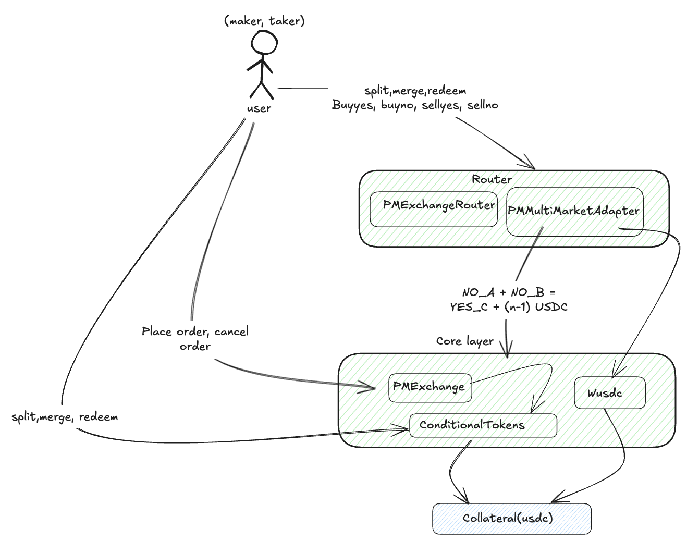
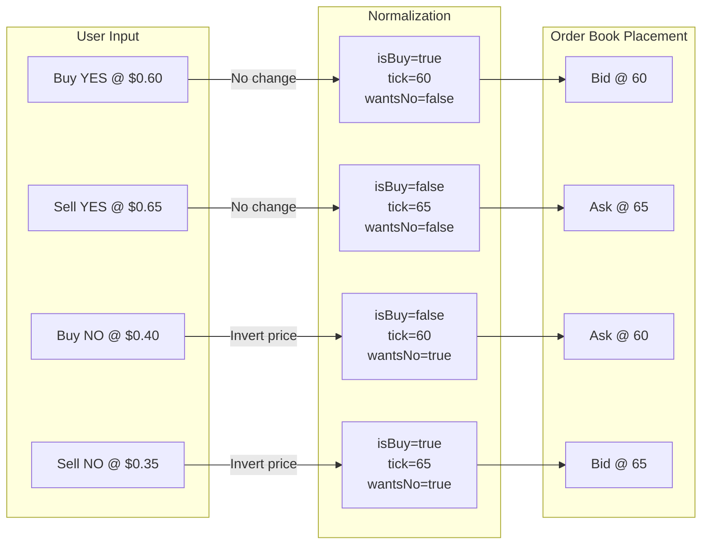
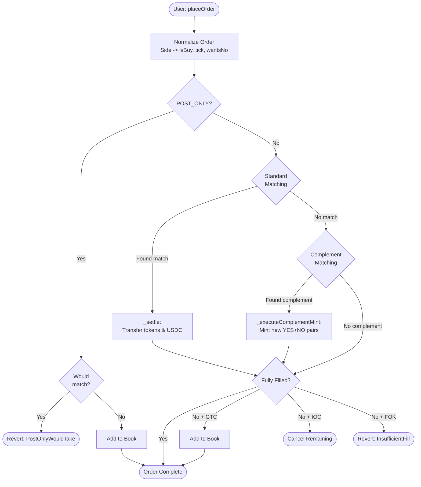
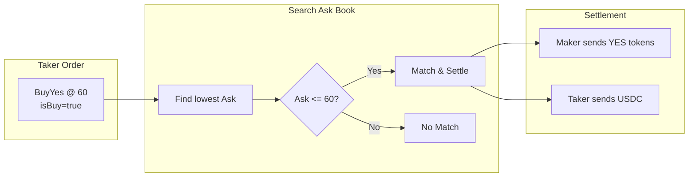
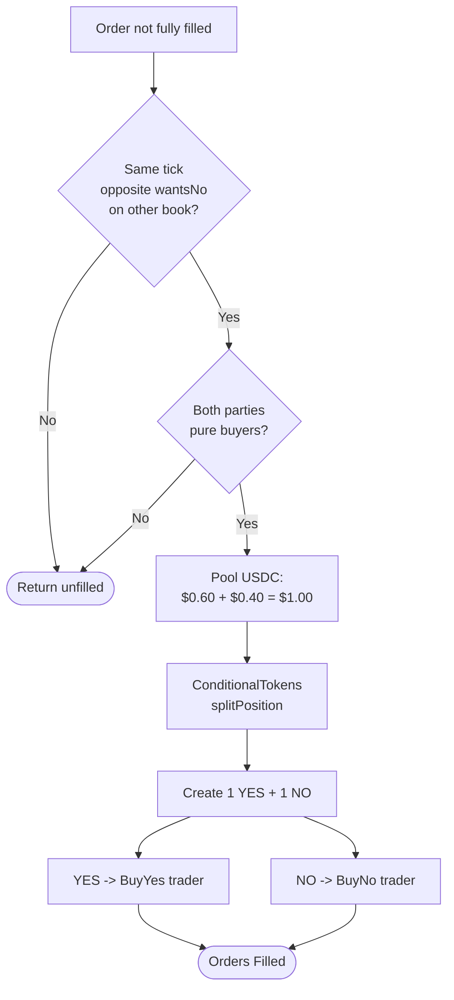
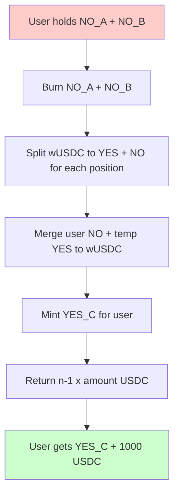
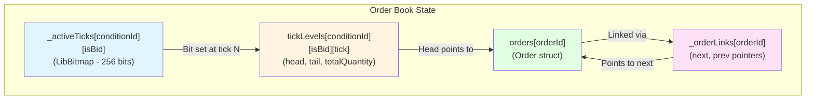
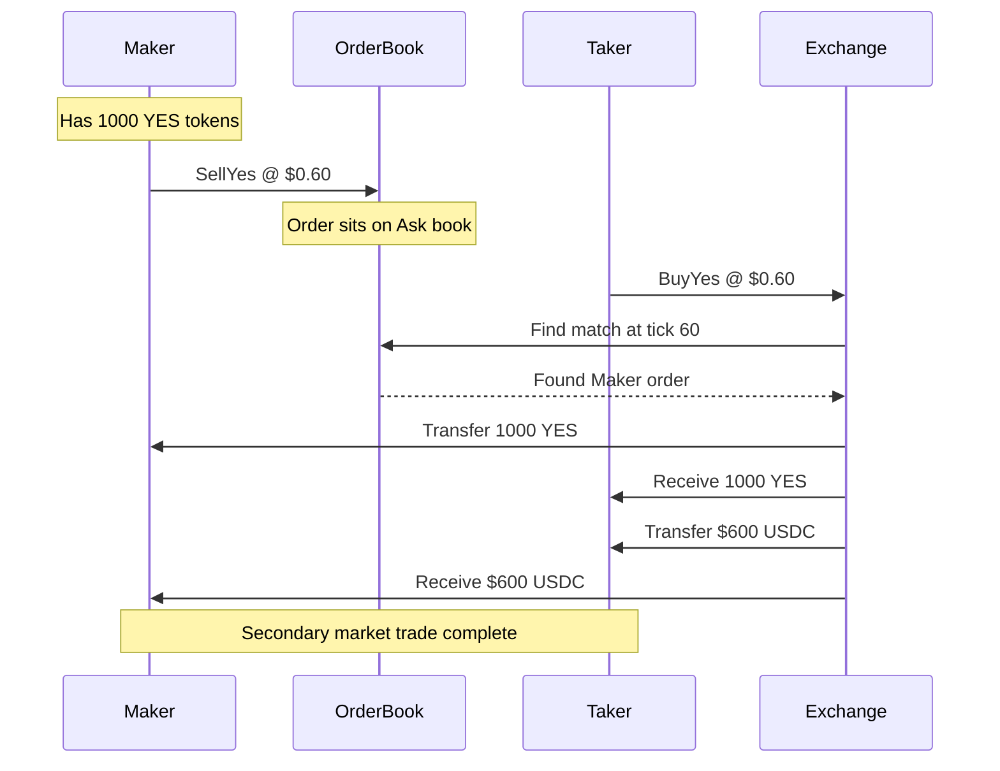
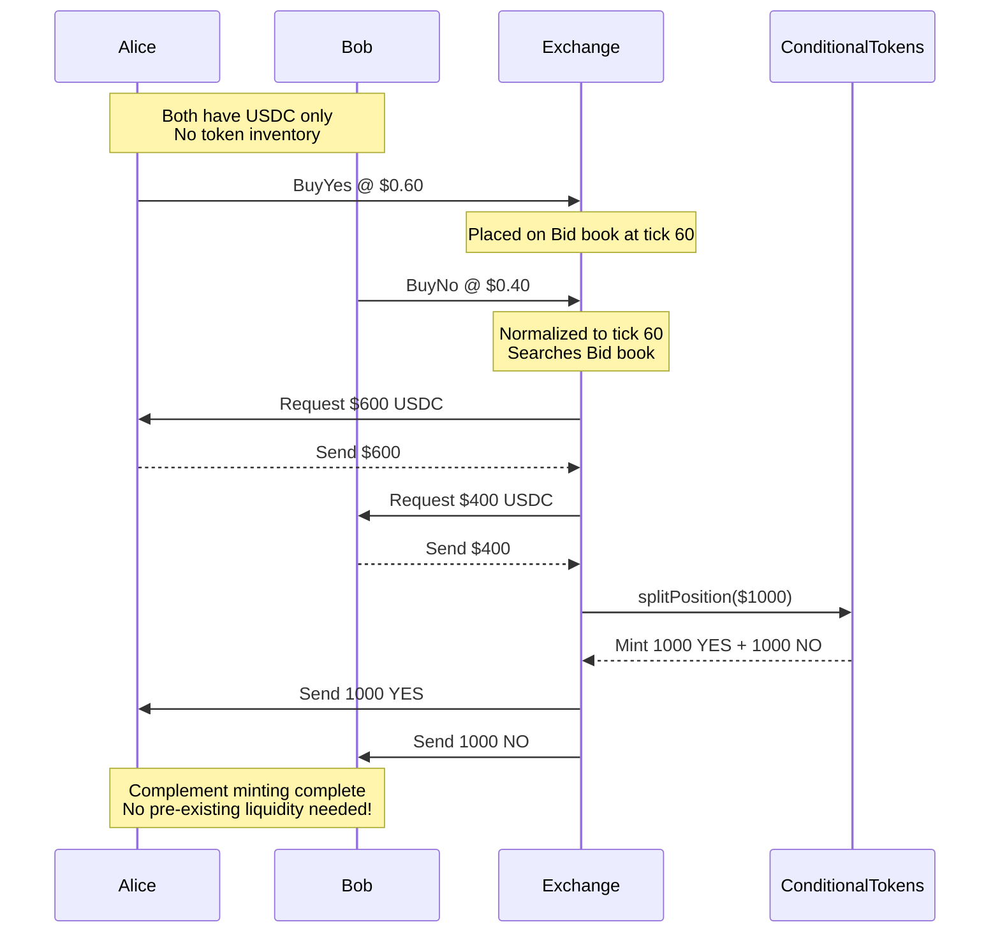
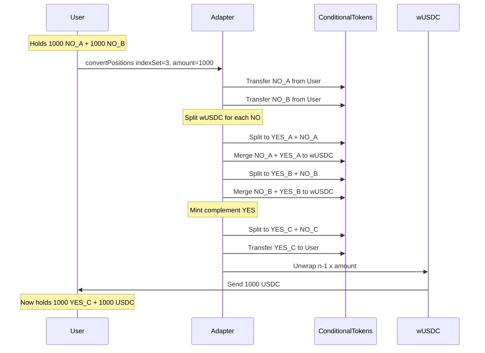

# Kombat Protocol – Technical Documentation

> **A High-Performance Prediction Market Infrastructure on Mantle**

[](https://soliditylang.org/)
[](https://getfoundry.sh/)
[](LICENSE)

---

## Table of Contents

1. [Overview](#1-overview)
2. [Architecture](#2-architecture)
3. [Order Model & Normalization](#3-order-model--normalization)
4. [Trade Execution Flow](#4-trade-execution-flow)
5. [Matching Engine](#5-matching-engine)
6. [Multi-Outcome Markets](#6-multi-outcome-markets)
7. [Data Structures](#7-data-structures)
8. [Execution Scenarios](#8-execution-scenarios)
9. [Deployment](#9-deployment)
10. [Core Contracts](#10-core-contracts)
    - [ConditionalTokens](#101-conditionaltokens)
    - [PMExchange](#102-pmexchange)
    - [PMExchangeRouter](#103-pmexchangerouter)
    - [PMMultiMarketAdapter](#104-pmmultimarketadapter)
    - [WUsdc](#105-wusdc)

---

## 1. Overview

Kombat Protocol is a **Central Limit Order Book (CLOB)** exchange designed specifically for prediction markets using **Conditional Tokens (CTF)**. Unlike standard ERC20 exchanges, it handles the unique property of prediction market tokens where **YES + NO = $1.00**. Also unlike traditional prediction markets that use off-chain matching engines and depend on order signing, the Kombat matching engine is completely on-chain, the liquidity level and orderbook is completely on-chain, using a **LibBitmap** for tick lookup and **doubly-linked lists** for order management, with ticks ranging from `$0.01 to $0.99`, leveraging mantle's fast throughput, low gas fees and and fast block times on mantle.

This architecture allows for full integration of prediction markets with other DeFi protocols, such as AMMs, yield farming, and more.

### Key Features

- **O(1) Operations**: LibBitmap for tick lookup, doubly-linked lists for order management
- **Complement Minting**: Automatically mint new tokens when BuyYes + BuyNo orders match
- **Multi-Outcome Markets**: Position conversion for 3+ outcome markets

- **Secure**: Reentrancy guards, safe ERC20 transfers, and access controls

### System Constants

| Constant | Value | Description |
|----------|-------|-------------|
| `PRICE_DENOMINATOR` | 1e18 | Price precision ($1.00) |
| `TICK_SIZE` | 1e16 | 1 tick = $0.01 |
| `MIN_TICK` | 1 | Minimum price ($0.01) |
| `MAX_TICK` | 99 | Maximum price ($0.99) |

---

## 2. Architecture



### Directory Structure

```
src/
├── ConditionalTokens.sol     # ERC1155-like conditional token implementation
├── PMExchange.sol            # Central limit order book (CLOB) exchange
├── PMExchangeRouter.sol      # User-friendly router for common operations
├── PMMultiMarketAdapter.sol  # Multi-outcome market adapter
├── WUsdc.sol                 # Wrapped USDC for multi-market collateral
├── amm/                      # AMM implementations (future)
└── libraries/
    └── CTHelpers.sol         # Helper functions for conditional tokens

test/
├── ConditionalTokens.t.sol      # ConditionalTokens unit tests
├── PMExchange.t.sol             # PMExchange unit tests
├── PMMultiMarketAdapter.t.sol   # Multi-market adapter tests
├── RouterTxFlowTest.t.sol       # Router transaction flow tests
└── integration/                  # Integration tests
```


---

## 3. Order Model & Normalization

### The "One Token" Principle

Users can place 4 types of orders, but the engine converts them into just 2 internal representations:



### Normalization Logic

```solidity
function _normalize(Side s, uint8 tick) internal pure returns (bool isBuy, uint8 yesTick, bool wantsNo) {
    if (s == Side.BuyYes)  return (true, tick, false);
    if (s == Side.SellYes) return (false, tick, false);
    if (s == Side.BuyNo)   return (false, 100 - tick, true);  // buyNo@40 = SellYes@60
    return (true, 100 - tick, true);                          // sellNo@40 = BuyYes@60
}
```

### Order Type Mapping

| User Side | isBuy | yesTick | wantsNo | Book Side |
|-----------|-------|---------|---------|-----------|
| BuyYes @ P | true | P | false | Bid @ P |
| SellYes @ P | false | P | false | Ask @ P |
| BuyNo @ P | false | 100-P | true | Ask @ (100-P) |
| SellNo @ P | true | 100-P | true | Bid @ (100-P) |

### Time-in-Force Options

| TiF | Description |
|-----|-------------|
| `GTC` | Good-Till-Cancelled - stays on book until filled or cancelled |
| `IOC` | Immediate-Or-Cancel - fill what you can, cancel rest |
| `FOK` | Fill-Or-Kill - must fill entirely or revert |
| `POST_ONLY` | Must be maker only - reverts if would take liquidity |

## 4. Trade Execution Flow



### Step-by-Step

1. **Normalization**: Convert user-facing Side to internal (isBuy, yesTick, wantsNo)
2. **POST_ONLY Check**: If POST_ONLY, verify order won't match immediately
3. **Standard Matching**: Match against opposite book (buyers match asks, sellers match bids)
4. **Complement Matching**: If unfilled, try to match BuyYes with BuyNo for minting
5. **Book Placement**: If GTC and unfilled, add remaining to order book
6. **TiF Enforcement**: Cancel or revert based on time-in-force

---

## 5. Matching Engine

### Standard Matching



The engine uses **price-time priority (FIFO)**:
- Buyers match against asks from lowest price upward
- Sellers match against bids from highest price downward
- Within a price level, orders are matched in order of submission

### Complement Matching (Minting)



**The Innovation**: Instead of requiring existing token liquidity, the exchange:
1. Takes $0.60 USDC from BuyYes trader
2. Takes $0.40 USDC from BuyNo trader
3. Combines to $1.00 USDC
4. Calls `splitPosition` to mint 1 YES + 1 NO
5. Distributes tokens to respective traders

---

## 6. Multi-Outcome Markets (NegRisk)

For markets with more than 2 outcomes (e.g., presidential elections), the adapter enables efficient position management.

### Position Conversion



### Capital Efficiency Example

**3-Candidate Election (A, B, C):**

| Scenario | Without Conversion | With Conversion |
|----------|-------------------|-----------------|
| Belief | "C will win" | "C will win" |
| Action | Buy YES_C directly | Buy NO_A + NO_B, convert |
| Collateral Needed | $1000 for 1000 YES_C | $1000 for 1000 NO_A + $1000 for 1000 NO_B = $2000 |
| After Conversion | N/A | Get back $1000 + 1000 YES_C |
| **Effective Cost** | $1000 | $1000 |
| **Capital Efficiency** | 1x | 3x (can reuse returned USDC) |

---

## 7. Data Structures



### `_activeTicks` (Bitmap)
- **What**: A 256-bit map of which ticks have orders
- **Why**: O(1) lookup for best bid/ask using bit manipulation (`fls`/`ffs`)
- **Operations**: `set()`, `unset()`, `get()`

### `tickLevels` (Price Levels)
- **What**: Stores head/tail order IDs and total quantity per tick
- **Why**: O(1) access to order queue at any price level

### `_orderLinks` (Doubly Linked List)
- **What**: Stores prev/next pointers for each order
- **Why**: O(1) insertion (append to tail) and removal (unlink)

### Bitmap Operations

```solidity
// Find highest active tick (best bid) - O(1)
function _findHighestActiveTick(bytes32 cid, bool isBid) internal view returns (uint8) {
    uint256 bucket = _activeTicks[cid][isBid].map[0];
    bucket = bucket & (((1 << 100) - 1) ^ 1);  // mask to bits 1-99
    if (bucket == 0) return 0;
    return uint8(LibBit.fls(bucket));  // find most significant bit
}

// Find lowest active tick (best ask) - O(1)
function _findLowestActiveTick(bytes32 cid, bool isBid) internal view returns (uint8) {
    uint256 bucket = _activeTicks[cid][isBid].map[0];
    bucket = bucket & (((1 << 100) - 1) ^ 1);
    if (bucket == 0) return 0;
    return uint8(LibBit.ffs(bucket));  // find least significant bit
}
```

---

## 8. Execution Scenarios

### Scenario A: Secondary Market Match



### Scenario B: Complement Minting



### Scenario C: Multi-Outcome Conversion




## 9. Deployment

### Deployment Script

```solidity
// script/Deploy.s.sol
pragma solidity ^0.8.30;

import "forge-std/Script.sol";
import "../src/ConditionalTokens.sol";
import "../src/PMExchange.sol";
import "../src/PMExchangeRouter.sol";
import "../src/PMMultiMarketAdapter.sol";

contract Deploy is Script {
    function run() external {
        vm.startBroadcast();
        
        // Deploy ConditionalTokens
        ConditionalTokens ct = new ConditionalTokens();
        
        // Deploy PMExchange (requires USDC address)
        // PMExchange exchange = new PMExchange(address(ct), USDC_ADDRESS);
        
        // Deploy Router
        // PMExchangeRouter router = new PMExchangeRouter(address(exchange), address(ct), USDC_ADDRESS);
        
        // Deploy Multi-Market Adapter
        // PMMultiMarketAdapter adapter = new PMMultiMarketAdapter(address(ct), USDC_ADDRESS);
        
        vm.stopBroadcast();
    }
}
```

### Deployment Commands

```bash
# Deploy to local anvil
forge script script/Deploy.s.sol --rpc-url http://localhost:8545 --broadcast

# Deploy to Mantle (mainnet)
forge script script/Deploy.s.sol --rpc-url https://rpc.mantle.xyz --broadcast --verify

# Verify contract
forge verify-contract <ADDRESS> src/PMExchange.sol:PMExchange --chain mantle
```

---

## 10. Core Contracts

### 10.1 ConditionalTokens

**File**: `src/ConditionalTokens.sol`

The foundation of the prediction market system. Implements an ERC1155-like token system for outcome positions.

#### Core Concepts

- **Condition**: A market question identified by `conditionId = keccak256(oracle, questionId, outcomeSlotCount)`
- **Position**: A token representing a stake in a specific outcome
- **Partition**: Division of outcomes (e.g., `[1, 2]` = `[YES, NO]` for binary markets)

#### Key Functions

```solidity
// Prepare a new condition (market)
function prepareCondition(address oracle, bytes32 questionId, uint256 outcomeSlotCount) 
    external returns (bytes32 conditionId);

// Report market outcome (oracle only)
function reportPayouts(bytes32 questionId, uint256[] calldata payouts) external;

// Split collateral into outcome tokens
function splitPosition(
    IERC20 collateralToken,
    bytes32 parentCollectionId,
    bytes32 conditionId,
    uint256[] calldata partition,  // e.g., [1, 2] for YES/NO
    uint256 amount
) external;

// Merge outcome tokens back to collateral
function mergePositions(
    IERC20 collateralToken,
    bytes32 parentCollectionId,
    bytes32 conditionId,
    uint256[] calldata partition,
    uint256 amount
) external;

// Redeem winning positions for collateral
function redeemPositions(
    IERC20 collateralToken,
    bytes32 parentCollectionId,
    bytes32 conditionId,
    uint256[] calldata indexSets
) external;
```

#### Token Operations

```solidity
// Transfer tokens
function transfer(address to, uint256 tokenId, uint256 amount) external returns (bool);
function transferFrom(address from, address to, uint256 tokenId, uint256 amount) external returns (bool);

// Approvals
function approve(address spender, uint256 tokenId, uint256 amount) external returns (bool);
function setApprovalForAll(address operator, bool approved) external;
```

#### Position ID Calculation

```
positionId = keccak256(collateralToken, collectionId)
collectionId = keccak256(conditionId, indexSet)
conditionId = keccak256(oracle, questionId, outcomeSlotCount)
```

---

### 10.2 PMExchange

**File**: `src/PMExchange.sol`

The central limit order book exchange for prediction market tokens.

#### Enums

```solidity
enum Side { BuyYes, SellYes, BuyNo, SellNo }

enum TiF {
    GTC,       // Good-Till-Cancelled
    IOC,       // Immediate-Or-Cancel
    FOK,       // Fill-Or-Kill
    POST_ONLY  // Maker only (no taker fills)
}

enum OrderStatus { Active, Filled, PartiallyFilled, Cancelled }
```

#### Core Structs

```solidity
/// @dev Packed order struct for gas efficiency
struct Order {
    uint64 orderId;
    address trader;
    bytes32 conditionId;
    uint8 tick;          // 1-99 representing $0.01-$0.99
    bool isBuy;          // normalized: true = buying YES
    bool wantsNo;        // true if user wants NO token
    uint128 quantity;
    uint128 filled;
    TiF tif;
    OrderStatus status;
    uint48 timestamp;
}

struct TickLevel {
    uint128 totalQuantity;  // total quantity at this tick
    uint64 head;            // first order in queue (FIFO)
    uint64 tail;            // last order in queue
    uint32 orderCount;
}

struct OrderLink {
    uint64 prev;  // previous order in queue
    uint64 next;  // next order in queue
}

struct Market {
    uint256 yesTokenId;
    uint256 noTokenId;
    uint48 endTime;
    bool registered;
    bool paused;
    bool resolved;
}

struct MarketSummary {
    uint256 yesTokenId;
    uint256 noTokenId;
    bool registered;
    bool paused;
    uint8 bestBidTick;
    uint128 bestBidSize;
    uint8 bestAskTick;
    uint128 bestAskSize;
    uint8 midPriceTick;
    uint8 spreadTicks;
    uint256 yesPriceBps;
    uint256 noPriceBps;
}
```

#### Admin Functions

```solidity
// Register a new market
function registerMarket(
    bytes32 conditionId, 
    uint256 yesTokenId, 
    uint256 noTokenId, 
    uint48 endTime
) external onlyOwner;

// Resolve market (stop trading)
function resolveMarket(bytes32 conditionId) external onlyOwner;

// Toggle market pause
function toggleMarketPause(bytes32 conditionId) external onlyOwner;
```

#### Order Functions

```solidity
// Place on-chain order
function placeOrder(
    bytes32 conditionId, 
    Side side, 
    uint8 tick, 
    uint128 quantity, 
    TiF tif
) external returns (uint64 orderId);

// Cancel active order
function cancelOrder(uint64 orderId) external;

// Set operator for order management
function setOperator(address operator, bool approved) external;
```

#### View Functions

```solidity
// Best bid/ask
function getBestBid(bytes32 conditionId) public view returns (uint8 tick, uint128 size);
function getBestAsk(bytes32 conditionId) public view returns (uint8 tick, uint128 size);
function getSpread(bytes32 conditionId) external view returns (uint8 bidTick, uint8 askTick, uint8 spreadTicks);

// Price utilities
function tickToPrice(uint8 tick) public pure returns (uint256);  // tick → 1e18 price
function priceToTick(uint256 price) public pure returns (uint8); // 1e18 price → tick

// Orderbook depth
function getOrderBookDepth(bytes32 conditionId, uint8 depth) external view 
    returns (uint8[] memory bidTicks, uint128[] memory bidSizes, uint8[] memory askTicks, uint128[] memory askSizes);
function getNoBookDepth(bytes32 conditionId, uint8 depth) external view 
    returns (uint8[] memory bidTicks, uint128[] memory bidSizes, uint8[] memory askTicks, uint128[] memory askSizes);

// User orders
function getUserOrders(address user, uint256 offset, uint256 limit) external view 
    returns (uint64[] memory orderIds, Order[] memory orderData);

// Market info
function getMarketCount() external view returns (uint256);
function getTokenIds(bytes32 conditionId) external view returns (uint256 yesTokenId, uint256 noTokenId);

// Frontend helpers
function getMidPrice(bytes32 conditionId) external view returns (uint8 midTick, bool hasLiquidity);
function getMarketPrices(bytes32 conditionId) external view 
    returns (uint256 yesPrice, uint256 noPrice, uint256 spreadBps);
function getMarketSummary(bytes32 conditionId) external view returns (MarketSummary memory);
function getMultipleMarketSummaries(bytes32[] calldata conditionIds) external view returns (MarketSummary[] memory);
function getAllMarkets(uint256 offset, uint256 limit) external view 
    returns (bytes32[] memory conditionIds, MarketSummary[] memory summaries);
function hasLiquidityAtTick(bytes32 conditionId, bool isBid, uint8 tick) external view 
    returns (bool hasLiquidity, uint128 size);
function estimateFill(bytes32 conditionId, Side side, uint128 quantity) external view 
    returns (uint128 fillableAmount, uint256 avgPriceBps, uint256 totalCost);
```

---

### 10.3 PMExchangeRouter

**File**: `src/PMExchangeRouter.sol`

A user-friendly router that simplifies common trading operations.

#### Market Orders

```solidity
// Market buy YES tokens
function marketBuyYes(bytes32 conditionId, uint128 size) external returns (uint256 cost);

// Market buy NO tokens
function marketBuyNo(bytes32 conditionId, uint128 size) external returns (uint256 cost);

// Market sell YES tokens
function marketSellYes(bytes32 conditionId, uint128 size) external returns (uint256 received);

// Market sell NO tokens
function marketSellNo(bytes32 conditionId, uint128 size) external returns (uint256 received);
```

#### Limit Orders

```solidity
// Limit buy YES tokens (fills immediate matches, rests remainder)
function limitBuyYes(bytes32 conditionId, uint8 tick, uint128 size) external returns (uint64 orderId);

// Limit buy NO tokens
function limitBuyNo(bytes32 conditionId, uint8 tick, uint128 size) external returns (uint64 orderId);

// Limit sell YES tokens (mints if needed)
function limitSellYes(bytes32 conditionId, uint8 tick, uint128 size) external returns (uint64 orderId);

// Limit sell NO tokens (mints if needed)
function limitSellNo(bytes32 conditionId, uint8 tick, uint128 size) external returns (uint64 orderId);
```

#### Position Management

```solidity
// Split USDC into YES + NO tokens
function split(bytes32 conditionId, uint128 amount) external;

// Merge YES + NO tokens back to USDC
function merge(bytes32 conditionId, uint128 amount) external;

// Redeem winning positions after resolution
function redeem(bytes32 conditionId) external;

// Cancel order
function cancelOrder(uint64 orderId) external;
```

---

### 10.4 PMMultiMarketAdapter

**File**: `src/PMMultiMarketAdapter.sol`

Enables NegRisk-style multi-outcome markets (e.g., 3-candidate elections).

#### Core Concept

For a 3-outcome market (A, B, C), holding NO on any 2 outcomes is equivalent to holding YES on the third:

```
NO_A + NO_B ≡ YES_C + (n-1) USDC
```

This allows efficient position conversion without needing external liquidity.

#### Structs

```solidity
struct Market {
    bytes32[] questionIds;      // Question IDs for each outcome
    address authorizedResolver; // Oracle that can resolve
    uint8 questionCount;        // Number of outcomes
    bool registered;
}
```

#### Functions

```solidity
// Register a multi-outcome market
function registerMarket(
    bytes32 marketId, 
    address authorizedResolver, 
    bytes32[] calldata questionIds
) external onlyOwner;

// Split USDC into YES/NO tokens for a specific outcome
function splitPosition(address oracle, bytes32 questionId, uint256 amount) external;

// Merge YES/NO back to USDC
function mergePositions(address oracle, bytes32 questionId, uint256 amount) external;

// Convert N NO positions to 1 YES position + (N-1) USDC
function convertPositions(bytes32 marketId, uint256 indexSet, uint256 amount) external;

// Report outcome (resolver only)
function reportOutcome(bytes32 marketId, bytes32 questionId, bool yesWins) external;

// Redeem winning positions
function redeemPositions(address ctOracle, bytes32 questionId) external;

// Admin: deposit wUSDC for conversions
function depositCollateral(uint256 amount) external;

// Admin: redeem orphan NO exposure
function redeemAdapterNO(bytes32 marketId, bytes32 questionId) external onlyOwner;
```

#### Helper Functions

```solidity
function getConditionId(address oracle, bytes32 questionId) public pure returns (bytes32);
function getCollectionId(address oracle, bytes32 questionId, bool outcome) public pure returns (bytes32);
function getPositionId(address oracle, bytes32 questionId, bool outcome) public view returns (uint256);
function getWUSDCBalance() external view returns (uint256);
```

---

### 10.5 WUsdc

**File**: `src/WUsdc.sol`

Wrapped USDC token used by the multi-market adapter for collateral accounting.

```solidity
// Wrap USDC to wUSDC (adapter only)
function wrap(address to, uint256 amount) external;

// Unwrap wUSDC to USDC (adapter only)
function unwrap(address to, uint256 amount) external;

// Mint wUSDC (adapter only)
function mint(uint256 amount) external;

// Burn wUSDC (adapter only)
function burn(uint256 amount) external;

// Set authorized adapter
function setAdapter(address _adapter) external onlyOwner;
```

---